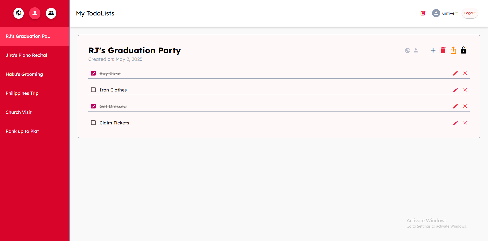

# Todo List Web Application

A simple Todo List app built with **Angular** (frontend) and powered by a REST API backend.



## 🚀 How to Build and Run

1. Install dependencies:

```bash
npm install
```

2. Start the development server:

```bash
ng serve
```

The app will be available at:

```
http://localhost:4200
```

## 📡 Backend API

This frontend application uses the following backend service:

➡️ **[https://unfspring2025wfa3.azurewebsites.net](https://unfspring2025wfa3.azurewebsites.net)**

---

# Development Information

This project was generated using [Angular CLI](https://github.com/angular/angular-cli) version 19.2.6.

## Code Scaffolding

Angular CLI includes powerful code scaffolding tools. To generate a new component, run:

```bash
ng generate component component-name
```

For a complete list of available schematics (such as `components`, `directives`, or `pipes`), run:

```bash
ng generate --help
```

## Building

To build the project, run:

```bash
ng build
```

This will compile your project and store the build artifacts in the `dist/` directory. By default, the production build optimizes your application for performance and speed.

## Running Unit Tests

To execute unit tests with the [Karma](https://karma-runner.github.io) test runner, use the following command:

```bash
ng test
```

## Running End-to-End Tests

For end-to-end (e2e) testing, run:

```bash
ng e2e
```

Angular CLI does not come with an end-to-end testing framework by default. You can choose one that suits your needs.
